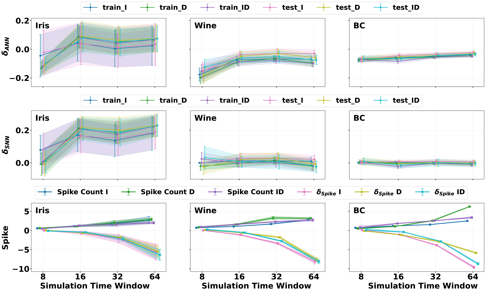

# Rule-Based-Greedy-for-SNN

## Project Overview

This project presents a **low-complexity, rule-based greedy optimization method** for tuning **heterogeneous absolute refractory periods** in Spiking Neural Networks (SNNs).

